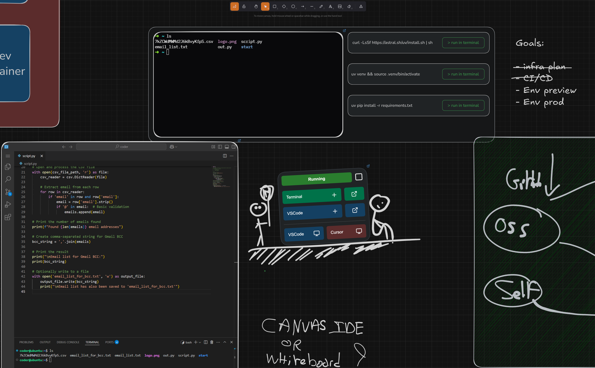

# pad.ws -  whiteboard as an IDE 🎨


[](https://pad.ws)

[pad.ws](https://pad.ws) is a whiteboard app that acts as a dev environment in your browser

## ✨ Features

* 🎨 **Interactive Whiteboard** - Draw, sketch and visualize your ideas with Excalidraw
* 💻 **Fully fledged IDE** - Access terminals and VS Code directly within the whiteboard
* ☁️ **Browser friendly** - Access your dev env from any device
* 🔄 **Seamless Workflow** - Switch between visual ideation and coding
* 🛠️ **Use your own tools** - Access your VM from your desktop client (VS Code & Cursor supported)

This uses [Excalidraw](https://github.com/excalidraw/excalidraw) for the whiteboard interface while [Coder](https://github.com/coder/coder) powers the cloud development environments.


## Try it online  🌐

Visit [pad.ws](https://pad.ws) for an official managed instance. During this beta, we offer free ubuntu dev environments without any setup

## Self-Hosting 🛠️

⚠️ IMPORTANT NOTICE: This repository is in early development stage. The setup provided in `docker-compose.yml` is for development and testing purposes only.
This simplified example lets you host pad on `localhost` but is not safe for real-life use without further configurations ⚠️


### ✅ Prerequisites
*   **Linux Host** (This was tested on Ubuntu only)
*   **Docker & Docker Compose:** Ensure you have both installed. [Install Docker](https://docs.docker.com/get-docker/) / [Install Docker Compose](https://docs.docker.com/compose/install/)


### 1️⃣ .env

*  Copy and review the default values
    ```bash
    cp .env.template .env
    ```

### 2️⃣ PostgreSQL 🐘
> Ensure persistence for the whole deployment (canvases and configs)

*   Run the PostgreSQL container using the provided configuration (e.g., in your `docker-compose.yml`)

    ```bash
    docker compose up -d postgres 
    ```

### 3️⃣ Redis 🔄
> In-memory data store for caching and session management with password authentication

*   Run the Redis container with password authentication
    ```bash
    docker compose up -d redis
    ```
*   The Redis password is configured in your `.env` file using the `REDIS_PASSWORD` variable

### 4️⃣ Keycloak 🔑
> OIDC provider for access and user management (within coder and pad app)
*   Run the Keycloak container
    ```bash
    docker compose up -d keycloak 
    ```
*   Access the Keycloak admin console http://localhost:8080
*   **Create a Realm:** Name it appropriately (e.g., `pad-ws`)
*   **Create a Client:**
    *   Give it a `Client ID` (e.g., `pad-ws-client`)
    *   Enable **Client Authentication**
    *   Add * to the valid redirect urls
    *   You can leave other settings as default for now
*   **Get Credentials:**
    *   Navigate to `Clients` -> `[Your Client ID]` -> `Credentials` tab
    *   Note the **Client secret**.
    *   Update your environment variables file (`.env`) with:
        ```dotenv
        OIDC_REALM=your_oidc_realm
        OIDC_CLIENT_ID=your_client_id 
        OIDC_CLIENT_SECRET=your_client_secret 
        ```
*   **Create a User:**
    *   Navigate to `Users` -> `Create user`
    *   Fill in the details
    *   **Important:** Tick `Email verified`
    *   Go to the `Credentials` tab for the new user and set a password
*   **Create an Audience:**
    *   Navigate to `Clients` -> `[Your Client ID]` -> `Client Scopes`
    *   Click on the dedicated scope of your Client (`[clientid]-dedicated`)
    *   Click on `Configure a new mapper`
    *   Then click on `Audience`
    *   Ensure `Included Client Audience` matches your `Client ID`
    *   Ensure `Add to access token` is On
    
### 5️⃣ Coder 🧑‍💻

*   **Find Docker Group ID:** You'll need this to grant necessary permissions
    ```bash
    getent group docker | cut -d: -f3 
    ```
*   Update your `.env` file with the `DOCKER_GROUP_ID`:
    ```dotenv
    DOCKER_GROUP_ID=your_docker_group_id 
    ```
*   Run the Coder container.
    ```bash
    docker compose up -d coder
    ```
*   **Access Coder UI:** Open [localhost:7080](http://localhost:7080) in your browser
*   **First Login:** Create an administrator user (e.g., `admin`)
*   **Create a Template:**
    *   Use the "Start from template" option.
    *   Choose a base image (e.g., `docker-containers` or a simple Ubuntu). Configure it as needed
*   **Generate API Key:**
    *   Click your profile picture (top right) -> `Account` -> `API Keys`
    *   Generate a new token
    *   Update your `.env`
        ```dotenv
        CODER_API_KEY=your_coder_api_key 
        ```
*   **Get Template ID:**
    *   Visit `http://localhost:7080/api/v2/templates` in your browser (or use `curl`)
    *   Find the `id` of the template you created
    *   Update your `.env`
        ```dotenv
        CODER_TEMPLATE_ID=your_coder_template_id # Example: 85fb21ba-085b-47a6-9f4d-94ea979aaba9
        ```
*   **Get Default Organization ID:**
    *   Visit `http://localhost:7080/api/v2/organizations` in your browser (or use `curl`)
    *   Find the `id` of your organization (usually the default one)
    *   Update your `.env`:
        ```dotenv
        CODER_DEFAULT_ORGANIZATION=your_organization_id # Example: 70f6af06-ef3a-4b4c-a663-c03c9ee423bb
        ```
*   **If you use a custom name for your workspace:**
    *   You need to provide the name as `CODER_WORKSPACE_NAME` in your `.env`. Otherwise, it will assume your workspace name is the default we chose: `ubuntu`.

### 6️⃣ Pad App 📝
> The fastAPI app that both serves the build frontend and the backend API to interface with Coder

*   **Run the Application:**
    *   Ensure all environment variables in your `.env` file are correctly set
    *   Run the `pad` application container

        ```bash
        docker compose up -d pad 
        ```

🎉 **Congratulations!**  You should now be able to access and login to your self-hosted pad at [localhost:8000](http://localhost:8000) 

🚧 *Did you have any issue while following this guide?*

*Please [let us know](https://github.com/pad-ws/pad.ws/issues) so we can improve the onboarding flow*

## 🚀 Project Growth

[](https://star-history.com/#pad-ws/pad.ws&Date)
