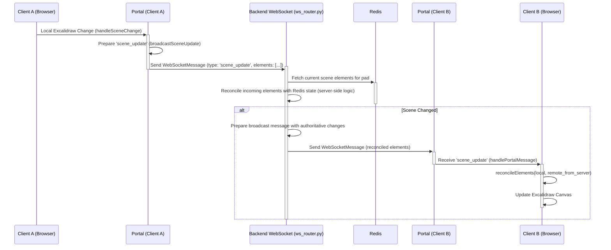
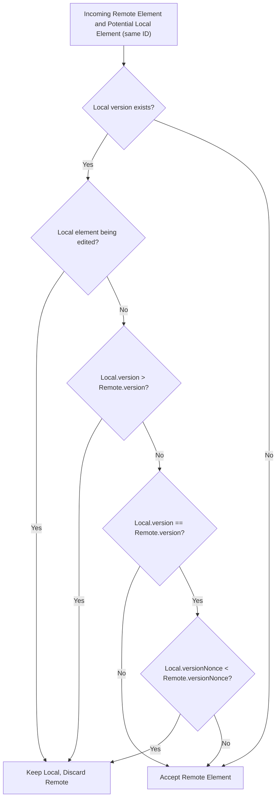

# Frontend Collaboration: Scene Updates and Reconciliation

## 1. Introduction

This document details the frontend mechanisms for handling collaborative scene updates in an Excalidraw-based application. It focuses on how local changes are broadcast, how remote changes are received and processed, and the core logic used for reconciling different versions of scene elements. The primary goal is to provide a clear understanding of the frontend's approach, enabling a backend engineer to design and implement a similar reconciliation and state management system on the server.

The key frontend components involved are:
-   `src/frontend/src/lib/collab/Collab.tsx`: Manages the overall collaboration state, listens to Excalidraw events, and orchestrates communication with the `Portal`.
-   `src/frontend/src/lib/collab/Portal.tsx`: Handles WebSocket connection management, message serialization/deserialization, and broadcasting/receiving messages.
-   Excalidraw's `reconcileElements` function (from `@atyrode/excalidraw`): Provides the core algorithm for merging local and remote scene elements.

## 2. Frontend Scene Update Workflow

### 2.1. Client-Side Changes & Broadcasting

When a user makes changes to the Excalidraw canvas locally, the following process occurs:

1.  **Detecting Local Scene Changes (`Collab.tsx`)**:
    *   The `Collab` component subscribes to Excalidraw's `onChange` event via `excalidrawAPI.onChange(this.handleSceneChange)`.
    *   The `handleSceneChange` method is triggered whenever the scene (elements or appState) changes.

2.  **Version Tracking**:
    *   `Collab` maintains two important version numbers:
        *   `this.lastBroadcastedSceneVersion`: Stores the scene version of the elements that were last successfully broadcast by this client.
        *   `this.state.lastProcessedSceneVersion`: Stores the scene version after this client has processed an update received from the server (or another client via the server).
    *   Excalidraw's `getSceneVersion(elements)` utility is used to calculate a version number for a given set of elements. This version typically increments with each change to any element.

3.  **Broadcasting Logic (`handleSceneChange` in `Collab.tsx`)**:
    *   It fetches all current elements, including deleted ones, using `this.props.excalidrawAPI.getSceneElementsIncludingDeleted()`.
    *   It calculates the `currentSceneVersion` using `getSceneVersion()`.
    *   A scene update is broadcast only if:
        *   `currentSceneVersion > this.lastBroadcastedSceneVersion`: The local scene is newer than what was last sent.
        *   `currentSceneVersion > this.state.lastProcessedSceneVersion`: The local scene is newer than the last scene state received and processed from remote. This prevents echoing back a scene update that was just received.
    *   If conditions are met, `this.portal.broadcastSceneUpdate('SCENE_UPDATE', allCurrentElements, false)` is called.
        *   `'SCENE_UPDATE'` indicates an incremental update.
        *   `false` for `syncAll` means a differential update will be attempted.
    *   `this.lastBroadcastedSceneVersion` is updated to `currentSceneVersion`.

4.  **Preparing and Sending Messages (`Portal.tsx`)**:
    *   The `broadcastSceneUpdate` method in `Portal` is responsible for sending the `scene_update` WebSocket message.
    *   **Update Types**:
        *   `SCENE_INIT`: Typically used for sending the entire scene when a user first joins or requests a full sync.
        *   `SCENE_UPDATE`: Used for incremental changes.
    *   **Differential Updates (`syncAll: false`)**:
        *   `Portal` maintains a `broadcastedElementVersions: Map<string, number>` which tracks the version of each element ID that it last broadcast.
        *   If `syncAll` is `false`, it filters the `elements` array to include only those elements whose `element.version` is greater than the `lastBroadcastedVersion` stored in the map.
        *   This reduces the amount of data sent over the network.
    *   **Full Sync (`syncAll: true`)**:
        *   All provided `elements` are sent.
        *   The `broadcastedElementVersions` map is cleared and then repopulated with the versions of all elements just sent. This ensures subsequent differential updates are based on this new baseline.
        *   A periodic full sync mechanism (`ENABLE_PERIODIC_FULL_SYNC` in `Collab.tsx`) can also trigger a `syncAll: true` update to ensure eventual consistency.
    *   **Message Structure**:
        *   A `WebSocketMessage` is constructed with `type: 'scene_update'`.
        *   The `data` payload includes:
            *   `update_subtype`: `'SCENE_INIT'` or `'SCENE_UPDATE'`.
            *   `elements`: The array of `OrderedExcalidrawElement` objects to be sent.
        *   The message is then JSON-stringified and sent via `this.socket.send()`.
    *   After sending, `broadcastedElementVersions` is updated for the elements that were actually sent.

```typescript
// Portal.tsx - Simplified broadcastSceneUpdate
public broadcastSceneUpdate = (
  updateType: 'SCENE_INIT' | 'SCENE_UPDATE',
  elements: ReadonlyArray<OrderedExcalidrawElement>,
  syncAll: boolean
) => {
  let elementsToSend = elements;

  if (!syncAll) {
    elementsToSend = elements.filter(element => {
      const lastBroadcastedVersion = this.broadcastedElementVersions.get(element.id) || -1;
      return element.version > lastBroadcastedVersion;
    });
  }

  const payload = {
    update_subtype: updateType,
    elements: elementsToSend,
  };

  if (elementsToSend.length > 0 || syncAll) {
     this.sendMessage('scene_update', payload); // sendMessage wraps it in WebSocketMessage and sends

    elementsToSend.forEach(element => {
      if (element && typeof element.id === 'string' && typeof element.version === 'number') {
        this.broadcastedElementVersions.set(element.id, element.version);
      }
    });
  }

  if (syncAll) {
    this.broadcastedElementVersions.clear();
     elements.forEach(element => {
      if (element && typeof element.id === 'string' && typeof element.version === 'number') {
        this.broadcastedElementVersions.set(element.id, element.version);
      }
    });
  }
};
```

### 2.2. Receiving Remote Scene Updates

When a client receives a `scene_update` message from the WebSocket server:

1.  **Message Handling (`Portal.tsx` -> `Collab.tsx`)**:
    *   `Portal`'s `socket.onmessage` handler parses the incoming JSON string.
    *   It validates the message against `WebSocketMessageSchema`.
    *   If valid, it calls `this.onMessage(validationResult.data)`, which in turn calls `this.collab.handlePortalMessage(validationResult.data)`.

2.  **Processing `scene_update` (`handlePortalMessage` in `Collab.tsx`)**:
    *   The method switches on `message.type`. For `'scene_update'`:
        *   It extracts `remoteElements` from `message.data.elements`.
        *   It ensures `this.props.excalidrawAPI` is available.
        *   It fetches the current local elements: `const localElements = this.props.excalidrawAPI.getSceneElementsIncludingDeleted();`.
        *   It gets the current `AppState`: `const currentAppState = this.props.excalidrawAPI.getAppState();`.
        *   **Element Restoration**: `const restoredRemoteElements = restoreElements(remoteElements, null);`
            *   This step is crucial. Elements received over JSON are plain objects. `restoreElements` converts them back into proper Excalidraw element instances, ensuring methods and prototype chains are correctly set up.
        *   **Reconciliation**: `const reconciled = reconcileElements(localElements, restoredRemoteElements as any[], currentAppState);`
            *   This is the core step where local and remote changes are merged. The `reconcileElements` function (detailed in the next section) determines the final state of each element.
        *   **Updating Local Scene**: `this.props.excalidrawAPI.updateScene({ elements: reconciled as ExcalidrawElementType[], commitToHistory: false });`
            *   The Excalidraw canvas is updated with the reconciled set of elements.
            *   `commitToHistory: false` is important here to prevent remote changes from creating undo/redo steps locally, which could lead to a confusing user experience. History should ideally be managed based on the user's own actions.
        *   **Updating Processed Version**: `this.setState({ lastProcessedSceneVersion: getSceneVersion(reconciled) });`
            *   The `lastProcessedSceneVersion` is updated to reflect the version of the scene just applied.

```typescript
// Collab.tsx - Simplified scene_update handling
case 'scene_update': {
  const remoteElements = messageData?.elements as ExcalidrawElementType[] | undefined;

  if (remoteElements !== undefined && this.props.excalidrawAPI) {
    const localElements = this.props.excalidrawAPI.getSceneElementsIncludingDeleted();
    const currentAppState = this.props.excalidrawAPI.getAppState();
    
    const restoredRemoteElements = restoreElements(remoteElements, null);
    
    const reconciled = reconcileElements(
      localElements,
      restoredRemoteElements as any[], // Cast as RemoteExcalidrawElement[]
      currentAppState
    );
    
    this.props.excalidrawAPI.updateScene({ elements: reconciled as ExcalidrawElementType[], commitToHistory: false });
    this.setState({ lastProcessedSceneVersion: getSceneVersion(reconciled) });
  }
  break;
}
```

## 3. Core Reconciliation Logic (Based on Excalidraw's `reconcile.ts`)

The `reconcileElements` function is central to ensuring consistency between local and remote scene states. It takes the local elements, remote elements, and the current `AppState` to produce a single, reconciled list of elements.

### 3.1. Objective

To merge a list of local Excalidraw elements with a list of remote Excalidraw elements, resolving conflicts deterministically to arrive at a consistent view of the scene for all collaborators.

### 3.2. Key Data Structures

*   **`OrderedExcalidrawElement`**: This is the fundamental type for elements. For reconciliation, the following properties are critical:
    *   `id: string`: A unique identifier for the element.
    *   `version: number`: A monotonically increasing number representing the "age" or "edit count" of an element. Higher means newer.
    *   `versionNonce: number`: A random number generated when an element is created or significantly modified. Used as a tie-breaker if versions are identical.
    *   `index: string | null`: A fractional index (e.g., "a0", "a1", "a0V") used for ordering elements on the canvas.
*   **`ReconciledExcalidrawElement`**: A type brand indicating an element has passed through reconciliation.
*   **`RemoteExcalidrawElement`**: A type brand indicating an element originated from a remote source.

### 3.3. Conflict Resolution (`shouldDiscardRemoteElement`)

This function determines whether a remote element should be discarded in favor of a local version if both exist (i.e., they have the same `id`).

```typescript
// Excalidraw's reconcile.ts (conceptual)
const shouldDiscardRemoteElement = (
  localAppState: AppState,
  local: OrderedExcalidrawElement | undefined,
  remote: RemoteExcalidrawElement,
): boolean => {
  if (
    local && // A local version of the element exists
    // Condition 1: Local element is being actively edited
    (local.id === localAppState.editingTextElement?.id ||
      local.id === localAppState.resizingElement?.id ||
      local.id === localAppState.newElement?.id || 
      // Condition 2: Local element is newer (higher version)
      local.version > remote.version ||
      // Condition 3: Versions are identical, use versionNonce as a tie-breaker
      // (lower versionNonce wins, ensuring deterministic outcome)
      (local.version === remote.version &&
        local.versionNonce < remote.versionNonce))
  ) {
    return true; // Discard the remote, keep the local
  }
  return false; // Keep the remote (or if no local, remote is accepted)
};
```

**Logic**:
1.  If a local element (`local`) exists with the same ID as the `remote` element:
    *   **Priority to Active Edits**: If the local element is currently being edited by the user (e.g., text editing, resizing), the local version is prioritized, and the remote update for this element is discarded. This prevents remote changes from disrupting an ongoing local interaction.
    *   **Version Comparison**: If `local.version > remote.version`, the local element is considered newer and is kept. The remote update is discarded.
    *   **Version Nonce Tie-Breaker**: If `local.version === remote.version` (versions are identical), the `versionNonce` is used. The element with the *lower* `versionNonce` is kept. This provides a deterministic way to resolve conflicts when timestamps or versions are the same, preventing elements from flickering or states from diverging due to race conditions.
2.  If no local element exists with the same ID, or if none of the above conditions to discard the remote element are met, the remote element is accepted (or preferred over an older/conflicting local one).

### 3.4. `reconcileElements` Algorithm

The `reconcileElements` function orchestrates the merging process:

```typescript
// Excalidraw's reconcile.ts (simplified algorithm)
export const reconcileElements = (
  localElements: readonly OrderedExcalidrawElement[],
  remoteElements: readonly RemoteExcalidrawElement[],
  localAppState: AppState,
): ReconciledExcalidrawElement[] => {
  // 1. Create a map of local elements for quick lookup by ID.
  const localElementsMap = arrayToMap(localElements); // Map<elementId, element>
  const reconciledElements: OrderedExcalidrawElement[] = [];
  const addedElementIds = new Set<string>(); // Tracks IDs already processed

  // 2. Process Remote Elements:
  // Iterate through each remote element.
  for (const remoteElement of remoteElements) {
    if (!addedElementIds.has(remoteElement.id)) {
      const localElement = localElementsMap.get(remoteElement.id);
      
      // Decide whether to discard the remote element based on conflict resolution.
      const discardRemote = shouldDiscardRemoteElement(
        localAppState,
        localElement,
        remoteElement,
      );

      if (localElement && discardRemote) {
        // Local element is preferred; add it to the reconciled list.
        reconciledElements.push(localElement);
      } else {
        // Remote element is preferred (or no local conflict); add it.
        reconciledElements.push(remoteElement);
      }
      addedElementIds.add(remoteElement.id);
    }
  }

  // 3. Process Remaining Local Elements:
  // Iterate through local elements to add any that weren't part of the remote set
  // (i.e., elements created locally but not yet known remotely, or elements whose
  // remote counterparts were discarded).
  for (const localElement of localElements) {
    if (!addedElementIds.has(localElement.id)) {
      reconciledElements.push(localElement);
      addedElementIds.add(localElement.id);
    }
  }

  // 4. Order and Validate Fractional Indices:
  // Sort all reconciled elements by their fractional index.
  const orderedElements = orderByFractionalIndex(reconciledElements);

  // (Throttled) Validate and synchronize fractional indices to ensure integrity.
  // This step corrects any duplicate or out-of-order indices.
  validateIndicesThrottled(orderedElements, localElements, remoteElements);
  syncInvalidIndices(orderedElements); // Ensures no duplicate indices

  return orderedElements as ReconciledExcalidrawElement[];
};
```

**Steps**:
1.  **Initialization**:
    *   Convert `localElements` into a `Map` (`localElementsMap`) for efficient ID-based lookups.
    *   Initialize an empty array `reconciledElements` to store the final list.
    *   Initialize a `Set` `addedElementIds` to keep track of element IDs that have been processed to avoid duplicates.

2.  **Process Remote Elements**:
    *   Iterate through each `remoteElement` in the `remoteElements` array.
    *   For each `remoteElement`:
        *   Retrieve the corresponding `localElement` (if it exists) from `localElementsMap` using `remoteElement.id`.
        *   Call `shouldDiscardRemoteElement(localAppState, localElement, remoteElement)` to determine if the local version should be kept over the remote one.
        *   If `localElement` exists and `shouldDiscardRemoteElement` returns `true`, add `localElement` to `reconciledElements`.
        *   Otherwise (i.e., the remote element is preferred, or there's no conflicting local element), add `remoteElement` to `reconciledElements`.
        *   Add `remoteElement.id` to `addedElementIds`.

3.  **Process Remaining Local Elements**:
    *   Iterate through each `localElement` in the original `localElements` array.
    *   If `localElement.id` is *not* in `addedElementIds` (meaning it wasn't processed during the remote elements loop, e.g., it's a new local element or its remote counterpart was discarded), add `localElement` to `reconciledElements`.

4.  **Order and Validate Indices**:
    *   `orderByFractionalIndex(reconciledElements)`: Sorts the `reconciledElements` array based on their `index` property (fractional index). This is crucial for maintaining the correct Z-ordering of elements on the canvas.
    *   `validateIndicesThrottled(...)` and `syncInvalidIndices(...)`: These functions (from Excalidraw's fractional indexing utilities) ensure that all fractional indices are valid, unique, and correctly ordered. `syncInvalidIndices` will mutate elements if necessary to fix duplicate indices.

The result is an array of `ReconciledExcalidrawElement` objects, representing the most up-to-date and consistent view of the scene.

## 4. Implications and Guidance for Backend Implementation (Python/Redis)

The backend (e.g., `ws_router.py`) will act as the central authority for scene state and will need a similar, albeit server-centric, reconciliation logic.

1.  **Authoritative State**: The backend will maintain the canonical state of the scene for each pad, likely stored in Redis.
2.  **Receiving Client Updates**: When the backend receives a `scene_update` message from a client:
    *   The `elements` in the message represent *that client's proposed changes* or *its current understanding of those elements*.
    *   The backend needs to "reconcile" these incoming elements against its current authoritative version of the scene stored in Redis.
3.  **Adapting Reconciliation Principles**:
    *   **Versioning**: The backend must store and manage `version` and `versionNonce` for each element in Redis.
    *   **Conflict Resolution**: When an update for an element `E` with `id=X, version=V_client, versionNonce=N_client` arrives:
        *   Fetch element `E'` with `id=X` from Redis (if it exists), which has `version=V_server, versionNonce=N_server`.
        *   Apply a server-side version of `shouldDiscardRemoteElement` logic. The server holds the authoritative version (conceptually "local") and the incoming client update is "remote":
            *   Server's current element: `(Version_Server, Nonce_Server)`
            *   Incoming client element: `(Version_Client, Nonce_Client)`
            *   If `Version_Client > Version_Server`, the client's update is newer and should be preferred.
            *   If `Version_Client < Version_Server`, the server's version is newer and should be retained.
            *   If `Version_Client === Version_Server`, the `versionNonce` is used as a tie-breaker:
                *   If `Nonce_Client < Nonce_Server`, the client's update takes precedence (mirroring the frontend's "lower nonce wins" principle).
                *   If `Nonce_Server < Nonce_Client`, the server's current version is retained.
                *   It's crucial for the backend to implement a consistent, deterministic tie-breaker.
            *   The "localAppState" (e.g., `editingTextElement`) considerations from the frontend are generally not applicable on the server side; conflicts are resolved primarily by version and nonce.
        *   The server decides which version (client's or its current one) becomes the new authoritative version based on these rules.
4.  **Handling Element Deletions**:
    *   The frontend's reconciliation logic inherently handles elements marked with `isDeleted` if they are present in the element lists.
    *   The backend will need a clear strategy for managing deleted elements within its authoritative state. This includes how deletions are represented in Redis (e.g., an `isDeleted` flag, or removal from the active set), how these are reconciled with incoming updates (e.g., a delete is a high-priority update), and how confirmed deletions are broadcast to other clients.
5.  **Storing Scene Data in Redis**:
    *   **Per-Element Storage**: A Redis Hash for each element `element:<pad_id>:<element_id>` storing its properties (including `version`, `versionNonce`, `index`, `isDeleted`, and other Excalidraw element attributes).
    *   **Pad Element List**: A Redis Sorted Set for each pad `pad:elements:<pad_id>` storing element IDs, scored by their fractional index `index` to maintain order. Or, a Redis List if order is managed differently.
    *   The `ws_router.py` currently uses Redis Streams (`pad:stream:<pad_id>`) for broadcasting events. The actual scene *state* might need a different Redis structure for efficient lookup and modification of individual elements.
6.  **Broadcasting Reconciled Changes**:
    *   After reconciling an incoming client update with its own state, if the authoritative state changes, the backend must broadcast the *updated authoritative elements* (including information about deletions) to all *other* connected clients for that pad.
    *   The broadcast message should contain the elements as they now exist in the backend's authoritative store.
7.  **Handling `SCENE_INIT` vs. `SCENE_UPDATE` from Client**:
    *   If a client sends `SCENE_INIT` (e.g., on joining), the backend should send its current full authoritative scene for that pad to that client (including all non-deleted elements).
    *   If a client sends `SCENE_UPDATE`, the backend performs reconciliation as described above.
8.  **Advanced Fractional Indexing Management on Backend**:
    *   Beyond simply storing an `index` string, the backend, as the authoritative source, must implement robust logic for managing fractional indices to ensure correct element ordering and prevent data corruption. The Excalidraw frontend's `fractionalIndex.ts` provides valuable insights into the required complexities. Key considerations for the backend include:
        *   **Core Index Generation**:
            *   The backend needs a reliable way to generate new fractional indices when inserting elements between existing ones or when reordering multiple elements. This is typically achieved using a library function like `generateNKeysBetween(indexA, indexB, count)` from the `fractional-indexing` npm package. The backend will need to find or implement a Python equivalent.
            *   *Example Scenario*: If inserting 3 new elements between an element with `index="a0"` and an element with `index="a1"`, the backend would need to generate 3 new indices that fall lexicographically between "a0" and "a1".
        *   **Deterministic Ordering and Tie-Breaking**:
            *   When retrieving and ordering elements (e.g., from a Redis Sorted Set using the fractional index as the score), a secondary deterministic tie-breaking mechanism is crucial if two elements happen to have the exact same fractional index (which should be rare if generated correctly but is a possible edge case).
            *   Excalidraw's `orderByFractionalIndex` function breaks ties by comparing element IDs (`a.id < b.id ? -1 : 1`). The backend should implement a similar tie-breaking rule for consistent ordering.
        *   **Server-Side Index Validation**:
            *   The backend should validate fractional indices it receives from clients or generates itself to ensure their integrity.
            *   A core validation function, conceptually similar to `isValidFractionalIndex(index, predecessorIndex, successorIndex)`, is essential.
            ```typescript
            // Conceptual logic for isValidFractionalIndex
            function isValidFractionalIndex(
              currentIndex: string | undefined,
              predecessorIndex: string | undefined,
              successorIndex: string | undefined,
            ): boolean {
              if (!currentIndex) { return false; } // Index must exist

              if (predecessorIndex && successorIndex) {
                // Must be between predecessor and successor
                return predecessorIndex < currentIndex && currentIndex < successorIndex;
              }
              if (!predecessorIndex && successorIndex) {
                // First element in a sequence
                return currentIndex < successorIndex;
              }
              if (predecessorIndex && !successorIndex) {
                // Last element in a sequence
                return predecessorIndex < currentIndex;
              }
              // Single element in the list, or an isolated element being checked
              return true; 
            }
            ```
            *   The backend might also need a broader validation function (like `validateFractionalIndices` in Excalidraw) that iterates through all elements in a pad to check for overall consistency, potentially logging errors or even attempting repairs if inconsistencies are found.
        *   **Synchronization and Repair of Indices**:
            *   In complex scenarios (e.g., merging conflicting updates, server-side reordering, or recovering from potential data inconsistencies), the backend might need logic to "heal" or re-synchronize fractional indices.
            *   Excalidraw's `syncInvalidIndices` and `syncMovedIndices` (along with helpers like `getInvalidIndicesGroups`) demonstrate this. These functions identify groups of elements with invalid or conflicting indices and regenerate them based on their current desired order in the array.
            *   While a full port of this logic might be complex, the backend should be designed with the possibility that it might need to re-evaluate and potentially regenerate indices for a subset of elements to maintain a correct and consistent order. This is especially important if the backend performs operations that directly alter element order beyond simple appends.
        *   **Bound Text Elements**: Excalidraw has specific logic for ensuring a bound text element's index is greater than its container's index. If the backend needs to enforce such semantic rules related to element types and their ordering, this adds another layer to index management. For general reconciliation, this might be a secondary concern compared to basic lexicographical ordering.
    *   Storing elements in a Redis Sorted Set using the fractional index as the score is a good starting point, but the backend application logic will need to embody these advanced management techniques.
9.  **Atomicity**: Operations involving reading from Redis, reconciling, writing back to Redis, and preparing a broadcast should be as atomic as possible to prevent race conditions. Lua scripting in Redis or careful application-level locking might be necessary for complex operations, especially when updating multiple elements and their fractional indices.

## 5. Conceptual Diagrams

### 5.1. Data Flow for Scene Update



### 5.2. Simplified `shouldDiscardRemoteElement` Logic



This document provides a foundational understanding of the frontend's collaboration mechanisms. The backend implementation will need to adapt these principles to a server-authoritative model, leveraging Redis for persistent state and efficient messaging.
